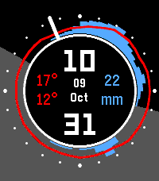

# WeatherDial

Showing you 5 key data points: time, date, temperature, rain, and daylight — the
5-in-1 shampoo of watchfaces.

Temperature and precipitation are plotted hour by hour around a 24-hour ring —
noon at the top, midnight at the bottom — and the night hours from sunset to
sunrise are shaded.



## Features

- 24-hour temperature line (red) and rain hills (blue) around the dial
- Shaded "tonight" sector from sunset to sunrise
- Large time and date in the center, with the next 24h high/low and rain total
- Four color themes — Light, Dark, Blue & Yellow, Black & White — switchable
  from the watch's configuration page
- Weather refreshes every 30 minutes; the last forecast is persisted on the
  watch so data is still shown when offline

## Requirements

- Pebble Time 2 (emery)
- The Pebble app on your phone, for geolocation and weather fetching

## Building & running

Build for all target platforms:

```sh
pebble build
```

Install on the emery emulator:

```sh
pebble install --emulator emery
```

Install to a paired phone:

```sh
pebble install --phone <ip>
```

## Configuration

Long-press the watchface in the Pebble app (or open its settings from the Pebble
app) and pick a theme. The choice is saved on the watch and persists across
restarts.

The same page has a latitude/longitude pair for pinning the forecast to a
specific place — useful in the emulator, where geolocation only ever resolves
to your IP's location. When both fields are filled in, geolocation is skipped
entirely; leave them blank to go back to the phone's location. A half-filled
pair is ignored, and the previous location stays in effect.

## Debugging in the emulator

Show watch and phone-side JS logs:

```sh
pebble logs --emulator emery
```

Open the settings page in a browser:

```sh
pebble emu-app-config --emulator emery
```

The settings page is the fastest way to move the forecast around. Set
latitude/longitude to pin a location (geolocation is skipped while both fields
are filled) and pick a theme in the same save:

| Place | Latitude | Longitude |
| --- | --- | --- |
| Rio de Janeiro | -22.9068 | -43.1729 |
| Tokyo | 35.6762 | 139.6503 |
| San Francisco | 37.7749 | -122.4194 |

Switch the theme without opening a browser — `0` Light, `1` Dark, `2` Blue &
Yellow, `3` Black & White:

```sh
pebble send-app-message --emulator emery --int 10010=1
```

The tool stamps the emulator with **your host's** UTC offset on every
connection, so the dial and the night sector sit in your timezone rather than
the pinned city's. Export the city's zone before any emulator command — every
command started without it resets the offset back:

```sh
export TZ=America/Sao_Paulo
```

Apply the new offset right now:

```sh
pebble emu-set-time "$(date +%s)"
```

| City | `TZ=` | Offset |
| --- | --- | --- |
| Rio de Janeiro | `America/Sao_Paulo` | UTC-3 |
| Tokyo | `Asia/Tokyo` | UTC+9 |
| San Francisco | `America/Los_Angeles` | UTC-7 (UTC-8 after Nov 1) |

## Platform support

v1.0.0 targets **emery** (Pebble Time 2) only for now.

## Acknowledgements

Weather data by [Open-Meteo](https://open-meteo.com/), provided under the
[CC BY 4.0](https://creativecommons.org/licenses/by/4.0/) licence.

## License

[MIT](LICENSE)
